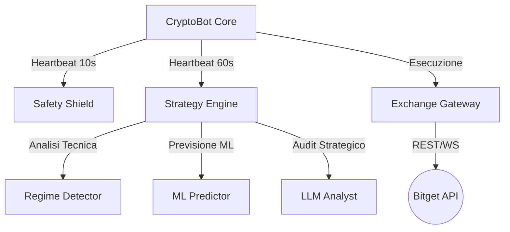

# Manuale Tecnico Avanzato: Antigravity Trading Bot (v30.31)

Questo documento costituisce la specifica tecnica definitiva dell'architettura modulare v30.0+ del bot Antigravity. È progettato per fornire una visione onnicomprensiva a sviluppatori senior, auditor tecnici o sistemi di Intelligenza Artificiale esterni.

---

## I. Architettura di Sistema e Flussi Dati

Il sistema segue un'architettura a **Micro-Moduli Core** orchestrati da un battito cardiaco centrale (Heartbeat).

### 1. Diagramma dei Componenti

### 2. Flusso Decisore (Decision Pipeline)
1.  **Ingestion**: `AssetScanner` recupera i ticker e i volumi.
2.  **Filtraggio**: Rimozione asset con volume < `min_volume_24h`.
3.  **Analisi MTF**: Verifica trend 4h e 1d tramite `StrategyEngine`.
4.  **Consensus Calculation**:
    - **Technical (30%)**: ADX + Donchian + RSI.
    - **Machine Learning (30%)**: Random Forest Classifier (Probabilità direzionale).
    - **AI Audit (40%)**: Analisi Gemini 2.5 Flash del contesto globale.
5.  **Score Finale**: Se `score >= consensus_threshold`, scatta l'esecuzione.

---

## II. Specifiche dei Moduli (Class-by-Class)

### 1. [CryptoBot](file:///Users/alex/.gemini/antigravity/scratch/trading-terminal/backend/bot.py) (Orchestratore)
*   **Metodo `run_deliberative_analysis_loop`**: Ciclo da 60s. Scansiona, delibera e invia ordini.
*   **Metodo `run_reactive_safety_loop`**: Ciclo da 10s. Monitora le posizioni attive invocando `SafetyShield`.
*   **Metodo `execute_order`**: Gestisce la **Flip Logic**. Se esiste una posizione opposta e il segnale è forte (>0.85 confidenza), chiude il vecchio trade e apre il nuovo.

### 2. [StrategyEngine](file:///Users/alex/.gemini/antigravity/scratch/trading-terminal/backend/strategy_engine.py) (Cervello)
*   **Metodo `analyze_opportunity`**: Coordina `RegimeDetector`, `MLPredictor` e `LLMAnalyst`.
*   **Metodo `calculate_consensus_score`**: Applica i pesi configurati. Include il **Blitz Boost**: se l'IA ha confidenza >0.85, il punteggio è forzato a 0.81 (esecuzione immediata).
*   **Modulo `_check_mtf_trend`**: Restituisce `True` solo se il prezzo 15m concorda con la EMA200 a 4 ore.

### 3. [SafetyShield](file:///Users/alex/.gemini/antigravity/scratch/trading-terminal/backend/safety_shield.py) (Scudo)
*   **Metodo `check_position`**: Calcola PnL e verifica soglie SL/TP.
*   **Algoritmo `Velocity Exit`**: Buffer di 12 campioni (120 sec). Se la variazione prezzo > 1.5x ATR in 2 min contro la posizione, chiude per "Panic Spike".
*   **Break-Even Logic**: Sposta lo Stop Loss a Entry + 0.3% non appena viene colpito il primo Take Profit (TP1).

### 4. [ExchangeGateway](file:///Users/alex/.gemini/antigravity/scratch/trading-terminal/backend/exchange_gateway.py) (Astrazione)
*   **Metodo `place_order`**: Gestisce la creazione di ordini Market con gestione automatica del `leverage`.
*   **Metodo `fetch_positions_robustly`**: Recupera le posizioni attive filtrando i dati "sporchi" dell'exchange (zombie positions).

---

## III. Matrice delle Strategie (Profili Bitget)

| Parametro | CONSERVATIVE | AGGRESSIVE | INSTITUTIONAL | BLITZ |
| :--- | :--- | :--- | :--- | :--- |
| **Leva (Leverage)** | 1x - 3x | 10x - 25x | 2x - 5x | 15x - 50x |
| **Rischio per Trade** | 1% | 15% | 1.5% | 25% |
| **Soglia Segnale** | Alta (RSI Estremo) | Media (Momentum) | Ultra-Alta (MTF) | Bassa (Predator) |
| **Filtro EMA200** | Sì (Stretto) | No | Sì (Obbligatorio) | No |
| **Confidenza IA Min** | 0.90 | 0.65 | 0.90 | 0.60 |
| **Filosofia IA** | Risk Manager | Momentum Hunter | Hedge Fund | HFT Sniper |

---

## IV. Logiche di Rischio e Sicurezza Avanzata

### 1. Sector Guard (Gestione Esposizione)
Implementato in `SectorManager.py`.
- Suddivide gli asset in: `AI`, `MAJOR` (BTC/ETH), `L1/L2`, `MEME`, `DEFI`.
- Limite massimo di 5 posizioni per settore (configurabile). Previene il "Catastrophic Correlation" (es. crollo improvviso di tutto il comparto AI).

### 2. Funding Penalty
Se il `funding rate` verso la posizione è eccessivo (> 0.05% per candela), `StrategyEngine` riduce automaticamente la taglia del 50% per evitare che il costo di mantenimento eroda il profitto atteso.

### 3. Deliberative vs Reactive
- **Deliberative**: Analisi lenta (60s) per trovare ingressi di qualità.
- **Reactive**: Risposta ultra-veloce (10s) per proteggere il capitale. Lo Shield vince sempre sull'Analysis se le condizioni di sicurezza sono violate.

---

## V. Integrazione Intelligenza Artificiale (Gemini 2.5 Flash)

Il bot utilizza il modello Gemini tramite REST API nativa per evitare dipendenze SDK pesanti e instabili.
- **Prompting**: Il prompt viene generato dinamicamente includendo: Profile Philosophy + Indicators + Market Context + Order Book Imbalance.
- **Output**: JSON strutturato che include `approved`, `confidence`, `suggested_leverage` e `reasoning`.
- **Latency**: Media di 1.8s per decisione, ottimizzata con ritardi di 2s tra le chiamate per evitare errori 503 Service Unavailable.

---

## V. Analisi Dettagliata dei Profili Operativi

Il bot adatta dinamicamente la propria logica in base al profilo selezionato. Ogni profilo carica un file JSON specifico che sovrascrive i parametri di `CryptoBot`, `StrategyEngine` e `LLMAnalyst`.

### 1. 🛡️ CONSERVATIVE (La Fortezza del Capitale)
*   **Obiettivo Primario**: Drawdown minimo e conservazione dell'equity.
*   **Logica Matematica**: 
    - **Leva**: 1x - 3x (Praticamente impossibile essere liquidati).
    - **Sizing**: 1% dell'Equity (Percentuale fissa).
    - **Filtri Tecnici**: ADX > 25 (Solo trend forti), RSI < 25 (Buy) o > 75 (Sell).
    - **EMA Trend**: Obbligatorio (Compra solo se sopra EMA200).
*   **Filosofia AI (Gemini)**: 
    - **Temperature**: 0.1 (Risposte deterministiche e fredde).
    - **Missione**: "Agisci come un controllore fiscale. Se il setup non è perfetto, scarta."
    - **Soglia Confidenza**: 0.90+.

### 2. 🔥 AGGRESSIVE (Il Predatore di Momentum)
*   **Obiettivo Primario**: Massimizzazione del turnover e profitto su volumi.
*   **Logica Matematica**:
    - **Leva**: 10x - 20x.
    - **Sizing**: 15% dell'Equity (Esposizione significativa).
    - **Filtri Tecnici**: ADX > 15 (Accetta anche trend deboli), RSI 30/70.
    - **EMA Trend**: Disabilitato (Opera anche in contro-trend se il momentum è forte).
*   **Filosofia AI (Gemini)**:
    - **Temperature**: 0.7 (Maggiore creatività nell'analisi dei pattern).
    - **Missione**: "Sei un cacciatore. Se vedi una spinta di prezzo e volume, non aspettare conferme multiple."
    - **Soglia Confidenza**: 0.65+.

### 3. 🏛️ INSTITUTIONAL (Logica Hedge Fund)
*   **Obiettivo Primario**: Crescita costante con diversificazione e basso rischio sistemico.
*   **Logica Matematica**:
    - **Leva**: 2x - 5x.
    - **Sizing**: 1.5% - 3.0% dell'Equity.
    - **Sector Manager**: Attivo al 100%. Limita rigorosamente le posizioni per categoria.
    - **Confluences**: Richiede la coincidenza di RSI, MACD e Bollinger Bands contemporaneamente.
*   **Filosofia AI (Gemini)**:
    - **Temperature**: 0.3 (Stabilità e logica).
    - **Missione**: "Risk Manager di un fondo. La priorità è la diversificazione. Non sovraesporre mai un settore."
    - **Soglia Confidenza**: 0.90+.

### 4. ⚡ BLITZ (Operatività ad Alto Impatto - "High Risk")
*   **Obiettivo Primario**: Exploit rapidi su piccoli capitali. È la configurazione più aggressiva ("suicida").
*   **Logica Matematica**:
    - **Leva**: 15x - 50x (Massimo rischio, massima velocità).
    - **Sizing**: 25% dell'Equity (Ogni trade è pesante rispetto all'account).
    - **Filtri Tecnici**: Minimi. Accetta RSI fino a 32/68 e ADX basso (15).
    - **Blitz Boost**: Se l'AI approva con confidenza >0.85, scavalca ogni filtro tecnico ed entra immediatamente.
*   **Filosofia AI (Gemini)**:
    - **Temperature**: 0.8 (Massima reattività).
    - **Missione**: "Attacco fulmineo. Capitalizza su segnali esplosivi ignorando la prudenza. Entra se vedi spinta."
    - **Soglia Confidenza**: 0.60+.

---

## VI. Conclusioni Tecniche e Analisi di Correlazione

Il sistema v30.31 è un ibrido ad alte prestazioni che combina l'analisi deterministica (Technical Indicators) con quella probabilistica (Machine Learning) e quella contestuale (IA). La protezione del capitale è gerarchica: Hard SL < Technical SL < Velocity Exit. 

La scelta del profilo non cambia solo i numeri, ma altera radicalmente la **"Personalità Decisionale"** del bot, rendendolo capace di adattarsi sia a mercati stabili (Conservative) che a fasi esplosive (Blitz).
